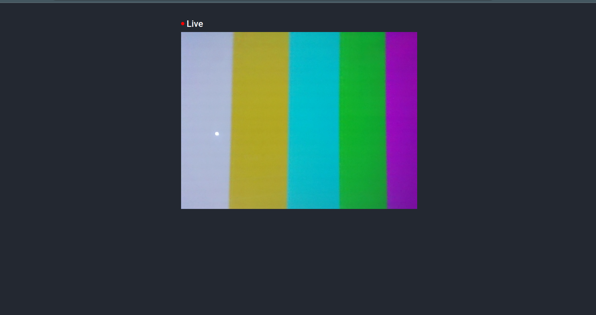

# Flask Camera
Simple Flask server with camera stream



## How to build and start project
Project can be start by simply pulling an starting docker image.
### Geting docker image
```
docker pull ghcr.io/mrlaki5/flask-camera:latest

# Note: there is option to build image localy:
# docker build . -t ghcr.io/mrlaki5/flask-camera:latest
```

### Start container with server inside
Camera mount is epxected to be on the path `/dev/video0`, you can change it in the command below
```
docker run --rm --device /dev/video0 -p 5000:5000 --name flask-camera-container ghcr.io/mrlaki5/flask-camera:latest
```

### Accessing the page
Page can be accessed on the link: [http://0.0.0.0:5000](http://0.0.0.0:5000)
